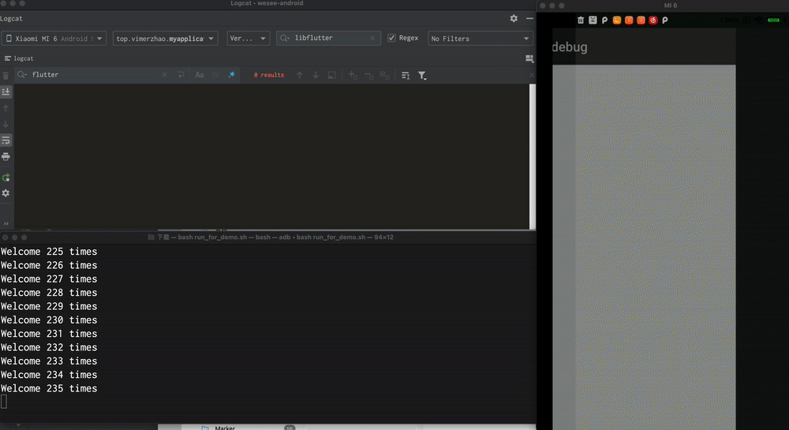

# Flutter Crash Demo

start app(first activity is a normal native page)

run ./run_for_demo.sh  (click to jump FlutterActivity and pop back)

```bash
for i in {1..1000}
do
   echo "Welcome $i times"
   adb shell input tap 300 400
   sleep 0.0
   sleep 0."$RANDOM"

   adb shell input keyevent 4
   sleep 1
done
```

Crash ：




log:

```txt
2021-08-11 17:16:50.125 28813-28813/? A/DEBUG:     #00 pc 0000000000766dd0  /data/app/com.example.flutter_debug-sX2uS8GG69c9UIStU5vI9w==/lib/arm64/libflutter.so (offset 0x2ac000)
2021-08-11 17:16:50.125 28813-28813/? A/DEBUG:     #01 pc 00000000004c4ec8  /data/app/com.example.flutter_debug-sX2uS8GG69c9UIStU5vI9w==/lib/arm64/libflutter.so (offset 0x2ac000)
2021-08-11 17:16:50.125 28813-28813/? A/DEBUG:     #02 pc 000000000042f2f0  /data/app/com.example.flutter_debug-sX2uS8GG69c9UIStU5vI9w==/lib/arm64/libflutter.so (offset 0x2ac000)
```
